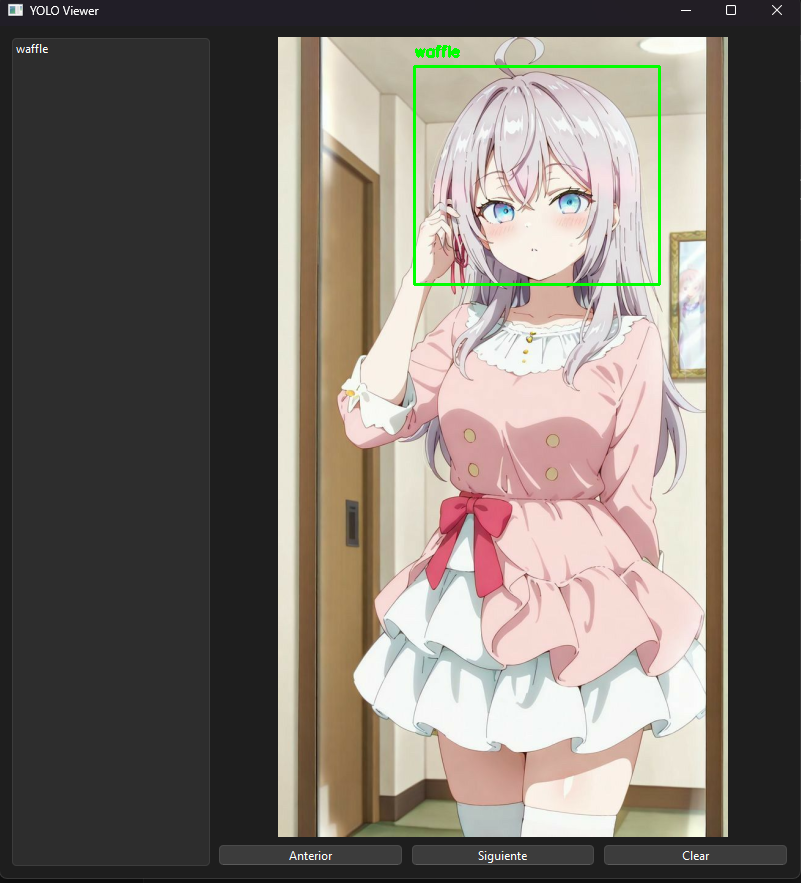

# YOLO Image Tagger

Una herramienta simple para etiquetar imágenes en formato YOLO. Desarrollada en Python, esta interfaz gráfica te permite seleccionar imágenes y dibujar cajas delimitadoras para cada objeto, generando automáticamente los archivos `.txt` correspondientes.

## 🖼️ Interfaz de Usuario


*Ejemplo de la interfaz de etiquetado.*

## 📁 Estructura de Archivos

```
project/
├── main.py
├── requirements.txt
├── config.json
```
## 📁 Para la data:
```
data/
├── images/
│   ├── image1.jpg
│   ├── image2.jpg
│   └── ...
└── labels/
    ├── image1.txt
    ├── image2.txt
    └── ...
```

## ⚙️ Configuración

La herramienta se configura mediante un archivo `config.json`. Ejemplo:

```json
{
    "directory_data": "<ruta/absoluta/tu/data>",
    "class_names": [
        "clase1",
        "clase2",
        "clase3"
    ]
}
```

- `directory_data`: Ruta donde se encuentran las imágenes a etiquetar.
- `class_names`: Lista de clases que se pueden asignar durante el etiquetado.

## ▶️ Uso

1. Clona el repositorio o descarga el código.
2. Instala las dependencias:
   ```bash
   pip install -r requirements.txt
   ```
3. Asegúrate de que el archivo `config.json` esté correctamente configurado.
4. Ejecuta la aplicación:
   ```bash
   python main.py
   ```
Nota: Si no defines la ruta de `directory_data`, no funcionará.
## ⌨️ Atajos de Comandos

- `Ctrl + X`: Quitar la última caja.
- `Ctrl + Space`: Siguiente imagen.
Nota: Al cambiar de imagen, se guardan automáticamente las etiquetas de la imagen anterior.

## 💾 Formato de salida (YOLO)

Cada imagen etiquetada genera un archivo `.txt` con el mismo nombre. Cada línea del archivo contiene:

```
<class_id> <x_center> <y_center> <width> <height>
```

Todos los valores están normalizados (entre 0 y 1) respecto al tamaño de la imagen.

## 📌 Notas

- Puedes hacer zoom o navegar entre imágenes según las herramientas de la interfaz.
- Soporte actual: clases simples, una sola clase o múltiples definidas en `config.json`.

## ✅ Requisitos

Python 3.8+ y las librerías listadas en `requirements.txt`.

## 🎥 Video Explicativo

Para una explicación más detallada y una demostración en tiempo real, puedes ver el siguiente video:

[Ver video en YouTube](https://youtu.be/RDCZz8VHiSs)

*Haz clic en la imagen para ver el video explicativo en YouTube.*

